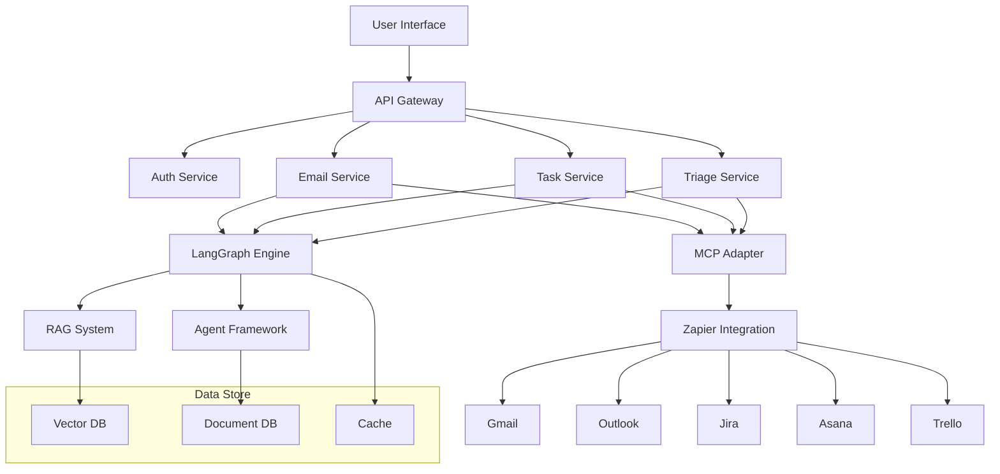

# Implementation Plan: Email Management & Triage System

## Introduction

This implementation guide outlines the development plan for the first two phases of FollowThrough AI:
1. Email Management and Automated Task System
2. Email Triage System

We'll leverage our existing LangGraph architecture, enhancing it with Model Context Protocol (MCP) for external integrations and Zapier for connecting with email and task management services.

## Architecture Overview

Our implementation will extend our current LangGraph system with:

1. **MCP Integration Layer**: Connects our system to external resources via the standardized Model Context Protocol
2. **Email Processing System**: Handles email fetching, parsing, and analysis
3. **Task Management Integration**: Creates and tracks tasks across multiple platforms
4. **Email Triage System**: Prioritizes and manages emails intelligently



## Phase 1: Email Management & Automated Task System (Weeks 1-6)

### Week 1-2: System Architecture & Email Integration

#### 1. Set up MCP Architecture

**Files to Create:**
- `src/mcp/mcp.module.ts`
- `src/mcp/mcp.service.ts`
- `src/mcp/adapters/langchain-adapter.ts`
- `src/mcp/models/resource.model.ts`
- `src/mcp/models/tool.model.ts`

**MCP Module Implementation:**

```typescript
// src/mcp/mcp.module.ts
import { Module } from '@nestjs/common';
import { ConfigModule } from '@nestjs/config';
import { MCPService } from './mcp.service';
import { LangchainMcpAdapter } from './adapters/langchain-adapter';

@Module({
  imports: [
    ConfigModule,
  ],
  providers: [
    MCPService,
    LangchainMcpAdapter,
  ],
  exports: [
    MCPService,
    LangchainMcpAdapter,
  ],
})
export class MCPModule {}
```

**MCP Service Implementation:**

```typescript
// src/mcp/mcp.service.ts
import { Injectable, Logger } from '@nestjs/common';
import { ConfigService } from '@nestjs/config';
import { Client } from '@modelcontextprotocol/sdk/client/index.js';
import { StreamableHTTPClientTransport } from '@modelcontextprotocol/sdk/client/streamableHttp.js';

@Injectable()
export class MCPService {
  private readonly logger = new Logger(MCPService.name);
  private clients: Map<string, Client> = new Map();

  constructor(private configService: ConfigService) {}

  async connectToServer(serverUrl: string): Promise<boolean> {
    try {
      if (this.clients.has(serverUrl)) {
        return true;
      }

      const client = new Client({
        name: 'followthrough-mcp-client',
        version: '1.0.0',
      });

      const transport = new StreamableHTTPClientTransport(
        new URL(serverUrl)
      );

      await client.connect(transport);
      this.clients.set(serverUrl, client);
      
      this.logger.log(`Connected to MCP server: ${serverUrl}`);
      return true;
    } catch (error) {
      this.logger.error(`Failed to connect to MCP server: ${error.message}`);
      return false;
    }
  }

  async getResources(serverUrl: string, resourceType: string): Promise<any[]> {
    try {
      const client = await this.getOrCreateClient(serverUrl);
      const resources = await client.listResources();
      
      // Filter resources by type if specified
      return resourceType 
        ? resources.filter(resource => resource.type === resourceType)
        : resources;
    } catch (error) {
      this.logger.error(`Failed to get resources: ${error.message}`);
      return [];
    }
  }

  async executeTool(serverUrl: string, toolId: string, params: any): Promise<any> {
    try {
      const client = await this.getOrCreateClient(serverUrl);
      const result = await client.callTool({
        name: toolId,
        arguments: params,
      });
      
      return result;
    } catch (error) {
      this.logger.error(`Failed to execute tool: ${error.message}`);
      throw error;
    }
  }

  private async getOrCreateClient(serverUrl: string): Promise<Client> {
    if (!this.clients.has(serverUrl)) {
      await this.connectToServer(serverUrl);
    }
    
    const client = this.clients.get(serverUrl);
    if (!client) {
      throw new Error(`No client found for server: ${serverUrl}`);
    }
    
    return client;
  }
}
```

**LangChain MCP Adapter Implementation:**

```typescript
// src/mcp/adapters/langchain-adapter.ts
import { Injectable, Logger } from '@nestjs/common';
import { ConfigService } from '@nestjs/config';
import { Client } from '@modelcontextprotocol/sdk/client/index.js';
import { StreamableHTTPClientTransport } from '@modelcontextprotocol/sdk/client/streamableHttp.js';
import { BaseChatModel } from '@langchain/core/language_models/chat_models';
import { BaseTool } from '@langchain/core/tools';
import { convertLangchainToolToMCPTool } from 'langchain-mcp-adapters';

@Injectable()
export class LangchainMcpAdapter {
  private readonly logger = new Logger(LangchainMcpAdapter.name);

  constructor(
    private configService: ConfigService,
  ) {}

  /**
   * Converts LangChain tools to MCP format for registering with an MCP server
   */
  convertLangchainToolsToMcpTools(tools: BaseTool[]): any[] {
    return tools.map(tool => convertLangchainToolToMCPTool(tool));
  }

  /**
   * Creates an MCP client that can be used to interact with external MCP-enabled systems
   */
  async createMcpClient(serverUrl: string, clientName: string = 'langchain-mcp-client'): Promise<Client> {
    try {
      const client = new Client({
        name: clientName,
        version: '1.0.0',
      });

      const transport = new StreamableHTTPClientTransport(
        new URL(serverUrl)
      );

      await client.connect(transport);
      return client;
    } catch (error) {
      this.logger.error(`Failed to create MCP client: ${error.message}`);
      throw error;
    }
  }

  /**
   * Registers LangChain tools with an MCP server
   */
  async registerToolsWithMcpServer(
    server: any,
    tools: BaseTool[],
  ): Promise<void> {
    try {
      const mcpTools = this.convertLangchainToolsToMcpTools(tools);
      
      // Register each tool with the MCP server
      for (const tool of mcpTools) {
        server.setRequestHandler(tool.schema, tool.handler);
      }
      
      this.logger.log(`Registered ${mcpTools.length} tools with MCP server`);
    } catch (error) {
      this.logger.error(`Failed to register tools with MCP server: ${error.message}`);
      throw error;
    }
  }
}

**Resource Model Implementation:**

```typescript
// src/mcp/models/resource.model.ts
export interface ResourceMetadata {
  id: string;
  name: string;
  type: string;
  description?: string;
  created?: string;
  modified?: string;
  [key: string]: any;
}

export class Resource {
  id: string;
  name: string;
  type: string;
  description?: string;
  metadata: ResourceMetadata;
  content?: any;
  uri?: string;

  constructor(data: Partial<Resource>) {
    this.id = data.id || '';
    this.name = data.name || '';
    this.type = data.type || '';
    this.description = data.description;
    this.metadata = data.metadata || { id: this.id, name: this.name, type: this.type };
    this.content = data.content;
    this.uri = data.uri;
  }

  static fromMcpResource(mcpResource: any): Resource {
    return new Resource({
      id: mcpResource.id || mcpResource.uri,
      name: mcpResource.name,
      type: mcpResource.type,
      description: mcpResource.description,
      uri: mcpResource.uri,
      metadata: mcpResource.metadata || {},
      content: mcpResource.content,
    });
  }

  toJSON(): any {
    return {
      id: this.id,
      name: this.name,
      type: this.type,
      description: this.description,
      uri: this.uri,
      metadata: this.metadata,
    };
  }
}
```

**Tool Model Implementation:**

```typescript
// src/mcp/models/tool.model.ts
export interface ToolParameter {
  name: string;
  description?: string;
  type: 'string' | 'number' | 'boolean' | 'object' | 'array';
  required?: boolean;
  default?: any;
  enum?: string[];
  items?: {
    type: string;
  };
  properties?: Record<string, ToolParameter>;
}

export interface ToolSchema {
  name: string;
  description?: string;
  parameters: Record<string, ToolParameter>;
  returns?: {
    type: string;
    description?: string;
    properties?: Record<string, any>;
  };
}

export class Tool {
  id: string;
  name: string;
  description?: string;
  schema: ToolSchema;
  handler?: (...args: any[]) => Promise<any>;

  constructor(data: Partial<Tool>) {
    this.id = data.id || '';
    this.name = data.name || '';
    this.description = data.description;
    this.schema = data.schema || { name: this.name, parameters: {} };
    this.handler = data.handler;
  }

  static fromMcpTool(mcpTool: any): Tool {
    return new Tool({
      id: mcpTool.id || mcpTool.name,
      name: mcpTool.name,
      description: mcpTool.description,
      schema: {
        name: mcpTool.name,
        description: mcpTool.description,
        parameters: mcpTool.parameters || {},
        returns: mcpTool.returns,
      },
    });
  }

  toJSON(): any {
    return {
      id: this.id,
      name: this.name,
      description: this.description,
      schema: this.schema,
    };
  }
}
```

#### 2. Create Email Integration Service

**Files to Create:**
- `src/email/email.module.ts`
- `src/email/email.service.ts`
- `src/email/models/email.model.ts`
- `src/email/models/thread.model.ts`
- `src/email/connectors/gmail.connector.ts`
- `src/email/connectors/outlook.connector.ts`

**Email Service Implementation:**

```typescript
// src/email/email.service.ts
import { Injectable, Logger } from '@nestjs/common';
import { ConfigService } from '@nestjs/config';
import { MCPService } from '../mcp/mcp.service';
import { Email } from './models/email.model';
import { Thread } from './models/thread.model';

@Injectable()
export class EmailService {
  private readonly logger = new Logger(EmailService.name);
  private readonly emailProviders = new Map<string, string>();

  constructor(
    private configService: ConfigService,
    private mcpService: MCPService,
  ) {
    // Initialize email provider MCP servers
    this.emailProviders.set('gmail', this.configService.get<string>('GMAIL_MCP_SERVER'));
    this.emailProviders.set('outlook', this.configService.get<string>('OUTLOOK_MCP_SERVER'));
  }

  async getEmails(userId: string, provider: string, options: any = {}): Promise<Email[]> {
    const serverUrl = this.emailProviders.get(provider);
    if (!serverUrl) {
      throw new Error(`Unsupported email provider: ${provider}`);
    }

    try {
      const result = await this.mcpService.executeTool(
        serverUrl,
        'fetchEmails',
        {
          userId,
          ...options,
        }
      );
      
      return result.emails.map(email => new Email(email));
    } catch (error) {
      this.logger.error(`Failed to fetch emails: ${error.message}`);
      throw error;
    }
  }

  async getEmail(userId: string, provider: string, emailId: string): Promise<Email> {
    const serverUrl = this.emailProviders.get(provider);
    if (!serverUrl) {
      throw new Error(`Unsupported email provider: ${provider}`);
    }

    try {
      const result = await this.mcpService.executeTool(
        serverUrl,
        'fetchEmail',
        {
          userId,
          emailId,
        }
      );
      
      return new Email(result.email);
    } catch (error) {
      this.logger.error(`Failed to fetch email: ${error.message}`);
      throw error;
    }
  }

  async getThread(userId: string, provider: string, threadId: string): Promise<Thread> {
    const serverUrl = this.emailProviders.get(provider);
    if (!serverUrl) {
      throw new Error(`Unsupported email provider: ${provider}`);
    }

    try {
      const result = await this.mcpService.executeTool(
        serverUrl,
        'fetchThread',
        {
          userId,
          threadId,
        }
      );
      
      return new Thread(result.thread);
    } catch (error) {
      this.logger.error(`Failed to fetch thread: ${error.message}`);
      throw error;
    }
  }

  async sendEmail(userId: string, provider: string, email: Partial<Email>): Promise<Email> {
    const serverUrl = this.emailProviders.get(provider);
    if (!serverUrl) {
      throw new Error(`Unsupported email provider: ${provider}`);
    }

    try {
      const result = await this.mcpService.executeTool(
        serverUrl,
        'sendEmail',
        {
          userId,
          email,
        }
      );
      
      return new Email(result.email);
    } catch (error) {
      this.logger.error(`Failed to send email: ${error.message}`);
      throw error;
    }
  }

  async updateEmailMetadata(userId: string, provider: string, emailId: string, metadata: any): Promise<Email> {
    const serverUrl = this.emailProviders.get(provider);
    if (!serverUrl) {
      throw new Error(`Unsupported email provider: ${provider}`);
    }

    try {
      const result = await this.mcpService.executeTool(
        serverUrl,
        'updateEmailMetadata',
        {
          userId,
          emailId,
          metadata,
        }
      );
      
      return new Email(result.email);
    } catch (error) {
      this.logger.error(`Failed to update email metadata: ${error.message}`);
      throw error;
    }
  }
}
```

#### 3. Implement Zapier Integration

**Files to Create:**
- `src/zapier/zapier.module.ts`
- `src/zapier/zapier.service.ts`
- `src/zapier/models/zap.model.ts`
- `src/zapier/triggers/email.trigger.ts`
- `src/zapier/actions/task.action.ts`

**Zapier Service Implementation:**

```typescript
// src/zapier/zapier.service.ts
import { Injectable, Logger } from '@nestjs/common';
import { ConfigService } from '@nestjs/config';
import { MCPService } from '../mcp/mcp.service';

@Injectable()
export class ZapierService {
  private readonly logger = new Logger(ZapierService.name);
  private readonly zapierServerUrl: string;

  constructor(
    private configService: ConfigService,
    private mcpService: MCPService,
  ) {
    this.zapierServerUrl = this.configService.get<string>('ZAPIER_MCP_SERVER');
  }

  async executeZap(zapId: string, inputData: any): Promise<any> {
    try {
      const result = await this.mcpService.executeTool(
        this.zapierServerUrl,
        'executeZap',
        {
          zapId,
          inputData,
        }
      );
      
      return result;
    } catch (error) {
      this.logger.error(`Failed to execute Zap: ${error.message}`);
      throw error;
    }
  }

  async getZaps(): Promise<any[]> {
    try {
      const result = await this.mcpService.executeTool(
        this.zapierServerUrl,
        'getZaps',
        {}
      );
      
      return result.zaps;
    } catch (error) {
      this.logger.error(`Failed to get Zaps: ${error.message}`);
      return [];
    }
  }

  async createEmailToTaskZap(
    emailProvider: string, 
    taskPlatform: string,
    filterCriteria: any,
    mappingRules: any
  ): Promise<any> {
    try {
      const result = await this.mcpService.executeTool(
        this.zapierServerUrl,
        'createZap',
        {
          trigger: {
            app: emailProvider,
            event: 'new_email',
            inputData: filterCriteria,
          },
          action: {
            app: taskPlatform,
            event: 'create_task',
            inputData: mappingRules,
          }
        }
      );
      
      return result.zap;
    } catch (error) {
      this.logger.error(`Failed to create Zap: ${error.message}`);
      throw error;
    }
  }
}
```

### Week 3-4: Email Processing & Analysis

#### 1. Enhance Email Models

**Files to Create/Update:**
- `src/email/models/email-attachment.model.ts`
- `src/email/models/email-address.model.ts`
- `src/email/dtos/email-query.dto.ts`
- Update `src/email/models/email.model.ts`
- Update `src/email/models/thread.model.ts`

#### 2. Implement Email Processing Service

**Files to Create:**
- `src/email/processors/email-processor.service.ts`
- `src/email/analyzers/language-analyzer.service.ts`
- `src/email/analyzers/intent-analyzer.service.ts`
- `src/email/analyzers/entity-extractor.service.ts`

**Email Processor Implementation:**

```typescript
// src/email/processors/email-processor.service.ts
import { Injectable, Logger } from '@nestjs/common';
import { LlmService } from '../../langgraph/llm/llm.service';
import { Email } from '../models/email.model';
import { Thread } from '../models/thread.model';
import { EntityExtractorService } from '../analyzers/entity-extractor.service';
import { IntentAnalyzerService } from '../analyzers/intent-analyzer.service';

@Injectable()
export class EmailProcessorService {
  private readonly logger = new Logger(EmailProcessorService.name);

  constructor(
    private llmService: LlmService,
    private entityExtractor: EntityExtractorService,
    private intentAnalyzer: IntentAnalyzerService,
  ) {}

  async processEmail(email: Email): Promise<Email> {
    try {
      // Extract entities (people, dates, organizations, etc.)
      const entities = await this.entityExtractor.extractEntities(email.body);
      
      // Analyze intent (request, information, schedule, etc.)
      const intent = await this.intentAnalyzer.analyzeIntent(email.body);
      
      // Set extracted metadata
      email.metadata = {
        ...email.metadata,
        entities,
        intent,
        processed: true,
        processedAt: new Date().toISOString(),
      };
      
      return email;
    } catch (error) {
      this.logger.error(`Failed to process email: ${error.message}`);
      email.metadata = {
        ...email.metadata,
        processed: false,
        processingError: error.message,
        processedAt: new Date().toISOString(),
      };
      return email;
    }
  }

  async processThread(thread: Thread): Promise<Thread> {
    try {
      // Process each email in the thread
      const processedEmails = await Promise.all(
        thread.emails.map(email => this.processEmail(email))
      );
      
      thread.emails = processedEmails;
      
      // Extract thread-level metadata
      thread.metadata = {
        ...thread.metadata,
        participants: this.extractUniqueParticipants(processedEmails),
        primaryIntent: this.determinePrimaryIntent(processedEmails),
        entities: this.combineEntities(processedEmails),
        processed: true,
        processedAt: new Date().toISOString(),
      };
      
      return thread;
    } catch (error) {
      this.logger.error(`Failed to process thread: ${error.message}`);
      thread.metadata = {
        ...thread.metadata,
        processed: false,
        processingError: error.message,
        processedAt: new Date().toISOString(),
      };
      return thread;
    }
  }
  
  private extractUniqueParticipants(emails: Email[]): string[] {
    // Extract unique participants across all emails
    const participants = new Set<string>();
    
    emails.forEach(email => {
      if (email.from) participants.add(email.from.address);
      email.to.forEach(to => participants.add(to.address));
      if (email.cc) email.cc.forEach(cc => participants.add(cc.address));
    });
    
    return Array.from(participants);
  }
  
  private determinePrimaryIntent(emails: Email[]): string {
    // Logic to determine the primary intent of the thread
    // Could use frequency, recency, or other heuristics
    const intents = emails.map(email => email.metadata?.intent).filter(Boolean);
    // Simple majority vote for now
    return this.getMostFrequent(intents);
  }
  
  private combineEntities(emails: Email[]): any {
    // Combine entities from all emails, removing duplicates
    const entities = {};
    
    emails.forEach(email => {
      if (!email.metadata?.entities) return;
      
      Object.entries(email.metadata.entities).forEach(([type, values]) => {
        if (!entities[type]) entities[type] = [];
        entities[type] = [...new Set([...entities[type], ...values])];
      });
    });
    
    return entities;
  }
  
  private getMostFrequent(arr: string[]): string {
    const counts = arr.reduce((acc, value) => {
      acc[value] = (acc[value] || 0) + 1;
      return acc;
    }, {});
    
    return Object.entries(counts)
      .sort((a, b) => b[1] - a[1])
      .map(x => x[0])[0];
  }
}
```

#### 3. Implement Email Threading and Indexing

**Files to Create:**
- `src/email/repositories/email-repository.service.ts`
- `src/email/indexing/email-indexer.service.ts`
- `src/email/threading/email-threader.service.ts`

**Email Threader Implementation:**

```typescript
// src/email/threading/email-threader.service.ts
import { Injectable, Logger } from '@nestjs/common';
import { Email } from '../models/email.model';
import { Thread } from '../models/thread.model';
import { EmailRepositoryService } from '../repositories/email-repository.service';

@Injectable()
export class EmailThreaderService {
  private readonly logger = new Logger(EmailThreaderService.name);

  constructor(
    private emailRepository: EmailRepositoryService,
  ) {}

  async buildThreads(emails: Email[]): Promise<Thread[]> {
    try {
      // Group emails by thread ID or reference headers
      const threadMap = new Map<string, Email[]>();
      
      // First pass: group by thread ID
      emails.forEach(email => {
        const threadId = this.getThreadId(email);
        if (!threadMap.has(threadId)) {
          threadMap.set(threadId, []);
        }
        threadMap.get(threadId).push(email);
      });
      
      // Create thread objects
      const threads: Thread[] = [];
      
      for (const [threadId, threadEmails] of threadMap.entries()) {
        // Sort emails by date
        const sortedEmails = threadEmails.sort((a, b) => 
          new Date(a.date).getTime() - new Date(b.date).getTime()
        );
        
        // Create thread object
        const thread = new Thread({
          id: threadId,
          subject: sortedEmails[0].subject,
          emails: sortedEmails,
          metadata: {
            created: sortedEmails[0].date,
            updated: sortedEmails[sortedEmails.length - 1].date,
            messageCount: sortedEmails.length,
          },
        });
        
        threads.push(thread);
      }
      
      return threads;
    } catch (error) {
      this.logger.error(`Failed to build threads: ${error.message}`);
      throw error;
    }
  }
  
  private getThreadId(email: Email): string {
    // Use thread ID if available
    if (email.threadId) {
      return email.threadId;
    }
    
    // Use references or in-reply-to headers
    if (email.references && email.references.length > 0) {
      return email.references[0];
    }
    
    if (email.inReplyTo) {
      return email.inReplyTo;
    }
    
    // Fallback: use message ID
    return email.id;
  }

  async updateThread(thread: Thread): Promise<Thread> {
    try {
      // Save all emails in the thread
      await Promise.all(
        thread.emails.map(email => this.emailRepository.saveEmail(email))
      );
      
      // Update thread metadata
      thread.metadata = {
        ...thread.metadata,
        updated: new Date().toISOString(),
        messageCount: thread.emails.length,
      };
      
      return thread;
    } catch (error) {
      this.logger.error(`Failed to update thread: ${error.message}`);
      throw error;
    }
  }
}
```

### Week 5-6: Task Execution Automation

#### 1. Task Management Service

**Files to Create:**
- `src/tasks/tasks.module.ts`
- `src/tasks/tasks.service.ts`
- `src/tasks/models/task.model.ts`
- `src/tasks/connectors/jira.connector.ts`
- `src/tasks/connectors/asana.connector.ts`
- `src/tasks/connectors/trello.connector.ts`

**Task Service Implementation:**

```typescript
// src/tasks/tasks.service.ts
import { Injectable, Logger } from '@nestjs/common';
import { ConfigService } from '@nestjs/config';
import { MCPService } from '../mcp/mcp.service';
import { ZapierService } from '../zapier/zapier.service';
import { Task } from './models/task.model';

@Injectable()
export class TasksService {
  private readonly logger = new Logger(TasksService.name);
  private readonly taskPlatforms = new Map<string, string>();

  constructor(
    private configService: ConfigService,
    private mcpService: MCPService,
    private zapierService: ZapierService,
  ) {
    // Initialize task platform MCP servers
    this.taskPlatforms.set('jira', this.configService.get<string>('JIRA_MCP_SERVER'));
    this.taskPlatforms.set('asana', this.configService.get<string>('ASANA_MCP_SERVER'));
    this.taskPlatforms.set('trello', this.configService.get<string>('TRELLO_MCP_SERVER'));
  }

  async createTask(userId: string, platform: string, task: Partial<Task>): Promise<Task> {
    const serverUrl = this.taskPlatforms.get(platform);
    if (!serverUrl) {
      throw new Error(`Unsupported task platform: ${platform}`);
    }

    try {
      const result = await this.mcpService.executeTool(
        serverUrl,
        'createTask',
        {
          userId,
          task,
        }
      );
      
      return new Task(result.task);
    } catch (error) {
      this.logger.error(`Failed to create task: ${error.message}`);
      throw error;
    }
  }

  async getTask(userId: string, platform: string, taskId: string): Promise<Task> {
    const serverUrl = this.taskPlatforms.get(platform);
    if (!serverUrl) {
      throw new Error(`Unsupported task platform: ${platform}`);
    }

    try {
      const result = await this.mcpService.executeTool(
        serverUrl,
        'fetchTask',
        {
          userId,
          taskId,
        }
      );
      
      return new Task(result.task);
    } catch (error) {
      this.logger.error(`Failed to fetch task: ${error.message}`);
      throw error;
    }
  }

  async getTasks(userId: string, platform: string, options: any = {}): Promise<Task[]> {
    const serverUrl = this.taskPlatforms.get(platform);
    if (!serverUrl) {
      throw new Error(`Unsupported task platform: ${platform}`);
    }

    try {
      const result = await this.mcpService.executeTool(
        serverUrl,
        'fetchTasks',
        {
          userId,
          ...options,
        }
      );
      
      return result.tasks.map(task => new Task(task));
    } catch (error) {
      this.logger.error(`Failed to fetch tasks: ${error.message}`);
      throw error;
    }
  }

  async updateTask(userId: string, platform: string, taskId: string, updates: Partial<Task>): Promise<Task> {
    const serverUrl = this.taskPlatforms.get(platform);
    if (!serverUrl) {
      throw new Error(`Unsupported task platform: ${platform}`);
    }

    try {
      const result = await this.mcpService.executeTool(
        serverUrl,
        'updateTask',
        {
          userId,
          taskId,
          updates,
        }
      );
      
      return new Task(result.task);
    } catch (error) {
      this.logger.error(`Failed to update task: ${error.message}`);
      throw error;
    }
  }

  async createEmailToTaskZap(
    userId: string, 
    emailProvider: string, 
    taskPlatform: string, 
    filterCriteria: any
  ): Promise<any> {
    try {
      // Create a Zap that converts emails to tasks based on criteria
      return await this.zapierService.createEmailToTaskZap(
        emailProvider,
        taskPlatform,
        filterCriteria,
        {
          title: '{{subject}}',
          description: '{{body}}',
          due_date: '{{due_date}}',
          assignee: '{{assignee}}',
        }
      );
    } catch (error) {
      this.logger.error(`Failed to create email-to-task Zap: ${error.message}`);
      throw error;
    }
  }
}
```

#### 2. Task Extraction Service

**Files to Create:**
- `src/tasks/extractors/email-task-extractor.service.ts`
- `src/tasks/extractors/email-thread-task-extractor.service.ts`
- `src/tasks/strategies/extraction-strategy.interface.ts`
- `src/tasks/strategies/llm-extraction-strategy.service.ts`
- `src/tasks/strategies/rule-based-extraction-strategy.service.ts`

**Email Task Extractor Implementation:**

```typescript
// src/tasks/extractors/email-task-extractor.service.ts
import { Injectable, Logger } from '@nestjs/common';
import { LlmService } from '../../langgraph/llm/llm.service';
import { Email } from '../../email/models/email.model';
import { Task } from '../models/task.model';
import { IExtractionStrategy } from '../strategies/extraction-strategy.interface';
import { LlmExtractionStrategy } from '../strategies/llm-extraction-strategy.service';
import { RuleBasedExtractionStrategy } from '../strategies/rule-based-extraction-strategy.service';

@Injectable()
export class EmailTaskExtractorService {
  private readonly logger = new Logger(EmailTaskExtractorService.name);
  private readonly strategies: IExtractionStrategy[];

  constructor(
    private llmService: LlmService,
    private llmStrategy: LlmExtractionStrategy,
    private ruleBasedStrategy: RuleBasedExtractionStrategy,
  ) {
    // Order matters - try rule-based first (faster), then LLM (more powerful but slower)
    this.strategies = [
      this.ruleBasedStrategy,
      this.llmStrategy,
    ];
  }

  async extractTasks(email: Email): Promise<Task[]> {
    try {
      let tasks: Task[] = [];
      
      // Try each strategy in order until one succeeds
      for (const strategy of this.strategies) {
        tasks = await strategy.extractTasks(email);
        
        if (tasks.length > 0) {
          this.logger.debug(`Extracted ${tasks.length} tasks using ${strategy.constructor.name}`);
          break;
        }
      }
      
      // Enrich tasks with email context
      tasks = tasks.map(task => ({
        ...task,
        metadata: {
          ...task.metadata,
          source: {
            type: 'email',
            id: email.id,
            threadId: email.threadId,
          },
        },
      }));
      
      return tasks;
    } catch (error) {
      this.logger.error(`Failed to extract tasks from email: ${error.message}`);
      return [];
    }
  }

  async validateAndEnrichTask(task: Partial<Task>): Promise<Task> {
    try {
      // Set default values for required fields
      if (!task.title) {
        throw new Error('Task must have a title');
      }
      
      // Create a due date if not set but mentioned in the description
      if (!task.dueDate && task.description) {
        task.dueDate = await this.extractDueDateFromText(task.description);
      }
      
      // Ensure proper formatting
      if (task.dueDate && typeof task.dueDate === 'string') {
        task.dueDate = new Date(task.dueDate).toISOString();
      }
      
      // Add default priority if not set
      if (!task.priority) {
        task.priority = 'medium';
      }
      
      return new Task(task);
    } catch (error) {
      this.logger.error(`Failed to validate and enrich task: ${error.message}`);
      throw error;
    }
  }
  
  private async extractDueDateFromText(text: string): Promise<string | null> {
    try {
      const model = this.llmService.getChatModel({
        temperature: 0.1,
        model: 'gpt-4o',
      });
      
      const response = await model.invoke([
        {
          role: 'system',
          content: 'You are a date extraction assistant. Extract any due dates or deadlines mentioned in the text. Return ONLY an ISO date string (YYYY-MM-DD) or "null" if no date is found.',
        },
        {
          role: 'user',
          content: text,
        },
      ]);
      
      const content = response.content.toString().trim();
      
      if (content === 'null' || !content) {
        return null;
      }
      
      return content;
    } catch (error) {
      this.logger.error(`Failed to extract due date: ${error.message}`);
      return null;
    }
  }
}
```

#### 3. Implement Approval Workflow

**Files to Create:**
- `src/tasks/approval/approval-workflow.service.ts`
- `src/tasks/approval/approval-request.model.ts`
- `src/tasks/approval/approval-status.enum.ts`
- `src/notifications/notifications.module.ts`
- `src/notifications/notifications.service.ts`

**Approval Workflow Implementation:**

```typescript
// src/tasks/approval/approval-workflow.service.ts
import { Injectable, Logger } from '@nestjs/common';
import { Task } from '../models/task.model';
import { ApprovalRequest } from './approval-request.model';
import { ApprovalStatus } from './approval-status.enum';
import { NotificationsService } from '../../notifications/notifications.service';

@Injectable()
export class ApprovalWorkflowService {
  private readonly logger = new Logger(ApprovalWorkflowService.name);
  private readonly pendingApprovals = new Map<string, ApprovalRequest>();

  constructor(
    private notificationsService: NotificationsService,
  ) {}

  async createApprovalRequest(
    userId: string,
    task: Task,
    metadata: any = {},
  ): Promise<ApprovalRequest> {
    try {
      const requestId = `approval-${Date.now()}-${Math.random().toString(36).substring(2, 10)}`;
      
      const request: ApprovalRequest = {
        id: requestId,
        userId,
        task,
        status: ApprovalStatus.PENDING,
        createdAt: new Date().toISOString(),
        metadata,
      };
      
      this.pendingApprovals.set(requestId, request);
      
      // Notify user about the pending approval
      await this.notificationsService.sendNotification(
        userId,
        {
          type: 'approval_request',
          title: 'Task Approval Required',
          body: `A new task "${task.title}" requires your approval.`,
          actionUrl: `/approvals/${requestId}`,
          data: {
            requestId,
            taskId: task.id,
            taskTitle: task.title,
          },
        }
      );
      
      return request;
    } catch (error) {
      this.logger.error(`Failed to create approval request: ${error.message}`);
      throw error;
    }
  }

  async getApprovalRequest(requestId: string): Promise<ApprovalRequest | null> {
    return this.pendingApprovals.get(requestId) || null;
  }

  async updateApprovalRequest(
    requestId: string,
    status: ApprovalStatus,
    comments?: string,
  ): Promise<ApprovalRequest> {
    try {
      const request = this.pendingApprovals.get(requestId);
      if (!request) {
        throw new Error(`Approval request not found: ${requestId}`);
      }
      
      // Update request status
      request.status = status;
      request.updatedAt = new Date().toISOString();
      request.comments = comments;
      
      // Store updated request
      this.pendingApprovals.set(requestId, request);
      
      // Notify user about the status change
      await this.notificationsService.sendNotification(
        request.userId,
        {
          type: 'approval_updated',
          title: `Task ${this.getStatusText(status)}`,
          body: `The task "${request.task.title}" has been ${this.getStatusText(status).toLowerCase()}.`,
          data: {
            requestId,
            taskId: request.task.id,
            taskTitle: request.task.title,
            status,
          },
        }
      );
      
      return request;
    } catch (error) {
      this.logger.error(`Failed to update approval request: ${error.message}`);
      throw error;
    }
  }
  
  private getStatusText(status: ApprovalStatus): string {
    switch (status) {
      case ApprovalStatus.APPROVED:
        return 'Approved';
      case ApprovalStatus.REJECTED:
        return 'Rejected';
      case ApprovalStatus.PENDING:
        return 'Pending';
      default:
        return 'Unknown';
    }
  }

  async getUserPendingApprovals(userId: string): Promise<ApprovalRequest[]> {
    const userApprovals: ApprovalRequest[] = [];
    
    for (const [_, request] of this.pendingApprovals.entries()) {
      if (request.userId === userId && request.status === ApprovalStatus.PENDING) {
        userApprovals.push(request);
      }
    }
    
    return userApprovals;
  }
}
```

## Conclusion

This implementation guide covers the development plan for the first phase of FollowThrough AI:

1. **Email Management and Automated Task System**
   - MCP integration for external communication
   - Email service with Gmail and Outlook integration
   - Email processing and analysis
   - Task management with Jira, Asana, and Trello integration
   - Task extraction and approval workflow