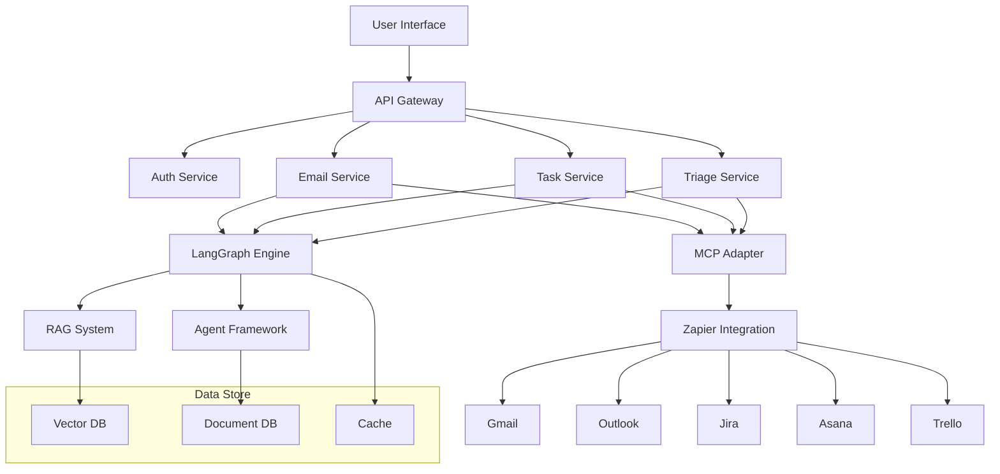

# Implementation Plan: Email Management & Triage System

## Introduction

This implementation guide outlines the development plan for the first phase of FollowThrough AI:
1. Email Management and Automated Task System

We'll leverage our existing LangGraph architecture, enhancing it with Model Context Protocol (MCP) for external integrations and Zapier for connecting with email and task management services.

## Architecture Overview

Our implementation will extend our current LangGraph system with:

1. **MCP Integration Layer**: ✅ COMPLETED - Connects our system to external resources via the standardized Model Context Protocol
2. **Email Processing System**: ⏳ IN PROGRESS - Handles email fetching, parsing, and analysis
3. **Task Management Integration**: ✅ COMPLETED - Creates and tracks tasks across multiple platforms



## Phase 1: Email Management & Automated Task System (Weeks 1-6)

### Week 1-2: System Architecture & Email Integration

#### 1. Set up MCP Architecture ✅ COMPLETED

**Files Created:**
- `src/mcp/mcp.module.ts` ✅ COMPLETED
- `src/mcp/mcp.service.ts` ✅ COMPLETED
- `src/mcp/adapters/langchain-adapter.ts` ✅ COMPLETED
- `src/mcp/models/resource.model.ts` ✅ COMPLETED
- `src/mcp/models/tool.model.ts` ✅ COMPLETED

**MCP Module Implementation:**

```typescript
// src/mcp/mcp.module.ts
import { Module } from '@nestjs/common';
import { ConfigModule } from '@nestjs/config';
import { MCPService } from './mcp.service';
import { LangchainMcpAdapter } from './adapters/langchain-adapter';

@Module({
  imports: [
    ConfigModule,
  ],
  providers: [
    MCPService,
    LangchainMcpAdapter,
  ],
  exports: [
    MCPService,
    LangchainMcpAdapter,
  ],
})
export class MCPModule {}
```

**MCP Service Implementation:**

```typescript
// src/mcp/mcp.service.ts
import { Injectable, Logger } from '@nestjs/common';
import { ConfigService } from '@nestjs/config';
import { Client } from '@modelcontextprotocol/sdk/client/index.js';
import { StreamableHTTPClientTransport } from '@modelcontextprotocol/sdk/client/streamableHttp.js';
import { LangchainMcpAdapter } from './adapters/langchain-adapter';
import { MultiServerMCPClient } from '@langchain/mcp-adapters';

@Injectable()
export class MCPService {
  private readonly logger = new Logger(MCPService.name);
  private clients: Map<string, Client> = new Map();
  private multiServerClient: MultiServerMCPClient | null = null;

  constructor(
    private configService: ConfigService,
    private langchainAdapter: LangchainMcpAdapter,
  ) {}

  /**
   * Initialize a multi-server client for accessing all configured MCP servers
   */
  async initializeMultiServerClient(): Promise<MultiServerMCPClient> {
    if (this.multiServerClient) {
      return this.multiServerClient;
    }

    const serverConfigs = {};
    
    // Add Gmail MCP server if configured
    const gmailMcpServer = this.configService.get<string>('GMAIL_MCP_SERVER');
    if (gmailMcpServer) {
      serverConfigs['gmail'] = { url: gmailMcpServer };
    }
    
    // Add Outlook MCP server if configured
    const outlookMcpServer = this.configService.get<string>('OUTLOOK_MCP_SERVER');
    if (outlookMcpServer) {
      serverConfigs['outlook'] = { url: outlookMcpServer };
    }
    
    // Add task management servers if configured
    const jiraMcpServer = this.configService.get<string>('JIRA_MCP_SERVER');
    if (jiraMcpServer) {
      serverConfigs['jira'] = { url: jiraMcpServer };
    }
    
    const asanaMcpServer = this.configService.get<string>('ASANA_MCP_SERVER');
    if (asanaMcpServer) {
      serverConfigs['asana'] = { url: asanaMcpServer };
    }
    
    const trelloMcpServer = this.configService.get<string>('TRELLO_MCP_SERVER');
    if (trelloMcpServer) {
      serverConfigs['trello'] = { url: trelloMcpServer };
    }
    
    // Add Zapier MCP server if configured
    const zapierMcpServer = this.configService.get<string>('ZAPIER_MCP_SERVER');
    if (zapierMcpServer) {
      serverConfigs['zapier'] = { url: zapierMcpServer };
    }
    
    if (Object.keys(serverConfigs).length === 0) {
      this.logger.warn('No MCP servers configured');
      throw new Error('No MCP servers configured');
    }
    
    this.multiServerClient = await this.langchainAdapter.createMultiServerClient(serverConfigs);
    return this.multiServerClient;
  }

  /**
   * Get all available tools from all configured MCP servers
   */
  async getAllAvailableTools(): Promise<any[]> {
    const client = await this.initializeMultiServerClient();
    return await this.langchainAdapter.loadAllTools(client);
  }

  /**
   * Get tools from specific MCP servers
   */
  async getToolsFromServers(serverNames: string[]): Promise<any[]> {
    const client = await this.initializeMultiServerClient();
    return await this.langchainAdapter.loadToolsFromServers(client, serverNames);
  }

  async connectToServer(serverUrl: string): Promise<boolean> {
    try {
      if (this.clients.has(serverUrl)) {
        return true;
      }

      const client = await this.langchainAdapter.createMcpClient(serverUrl);
      this.clients.set(serverUrl, client);
      
      this.logger.log(`Connected to MCP server: ${serverUrl}`);
      return true;
    } catch (error) {
      this.logger.error(`Failed to connect to MCP server: ${error.message}`);
      return false;
    }
  }

  async getResources(serverUrl: string, resourceType?: string): Promise<any[]> {
    try {
      const client = await this.getOrCreateClient(serverUrl);
      const resources = await client.listResources();
      
      // Filter resources by type if specified
      if (resourceType && Array.isArray(resources)) {
        return resources.filter(resource => 
          resource && typeof resource === 'object' && 'type' in resource && resource.type === resourceType
        );
      }
      
      return Array.isArray(resources) ? resources : [];
    } catch (error) {
      this.logger.error(`Failed to get resources: ${error.message}`);
      return [];
    }
  }

  async executeTool(serverUrl: string, toolId: string, params: any): Promise<any> {
    try {
      const client = await this.getOrCreateClient(serverUrl);
      const result = await client.callTool({
        name: toolId,
        arguments: params,
      });
      
      return result;
    } catch (error) {
      this.logger.error(`Failed to execute tool: ${error.message}`);
      throw error;
    }
  }

  async loadTools(serverUrl: string): Promise<any[]> {
    try {
      const client = await this.getOrCreateClient(serverUrl);
      const serverName = new URL(serverUrl).hostname;
      return await this.langchainAdapter.loadServerTools(serverName, client);
    } catch (error) {
      this.logger.error(`Failed to load tools: ${error.message}`);
      return [];
    }
  }

  /**
   * Execute a tool by its name with the provided parameters using the multi-server client
   */
  async executeToolAcrossServers(toolName: string, params: any): Promise<any> {
    try {
      const client = await this.initializeMultiServerClient();
      
      // If tool name contains server prefix (server__toolName), we need to get the right client
      if (toolName.includes('__')) {
        const [serverName, actualToolName] = toolName.split('__', 2);
        const serverClient = await client.getClient(serverName);
        
        if (!serverClient) {
          throw new Error(`No client found for server: ${serverName}`);
        }
        
        return await serverClient.callTool({
          name: actualToolName,
          arguments: params,
        });
      }
      
      // If no server prefix, try executing on all servers until one succeeds
      const tools = await this.langchainAdapter.loadAllTools(client);
      const matchingTool = tools.find(tool => tool.name === toolName);
      
      if (!matchingTool) {
        throw new Error(`No tool found with name: ${toolName}`);
      }
      
      // Execute using the tool's execute method
      return await matchingTool.invoke(params);
    } catch (error) {
      this.logger.error(`Failed to execute tool across servers: ${error.message}`);
      throw error;
    }
  }

  private async getOrCreateClient(serverUrl: string): Promise<Client> {
    if (!this.clients.has(serverUrl)) {
      await this.connectToServer(serverUrl);
    }
    
    const client = this.clients.get(serverUrl);
    if (!client) {
      throw new Error(`No client found for server: ${serverUrl}`);
    }
    
    return client;
  }
}
```

**LangChain MCP Adapter Implementation:**

```typescript
// src/mcp/adapters/langchain-adapter.ts
import { Injectable, Logger } from '@nestjs/common';
import { ConfigService } from '@nestjs/config';
import { Client } from '@modelcontextprotocol/sdk/client/index.js';
import { StreamableHTTPClientTransport } from '@modelcontextprotocol/sdk/client/streamableHttp.js';
import { Tool as LangchainTool } from '@langchain/core/tools';
import { MultiServerMCPClient, loadMcpTools } from '@langchain/mcp-adapters';

@Injectable()
export class LangchainMcpAdapter {
  private readonly logger = new Logger(LangchainMcpAdapter.name);

  constructor(
    private configService: ConfigService,
  ) {}

  /**
   * Creates a multi-server MCP client to interact with multiple MCP-enabled services
   */
  async createMultiServerClient(serverConfigs: {[key: string]: {url: string, headers?: Record<string, string>}}): Promise<MultiServerMCPClient> {
    try {
      const config = {
        mcpServers: {},
        prefixToolNameWithServerName: true,
      };
      
      // Convert server configs to the required format
      Object.entries(serverConfigs).forEach(([serverName, serverConfig]) => {
        config.mcpServers[serverName] = {
          url: serverConfig.url,
          type: 'http',
          headers: serverConfig.headers,
        };
      });
      
      this.logger.log(`Creating MultiServerMCPClient with ${Object.keys(serverConfigs).length} servers`);
      return new MultiServerMCPClient(config);
    } catch (error) {
      this.logger.error(`Failed to create MultiServerMCPClient: ${error.message}`);
      throw error;
    }
  }

  /**
   * Load all tools from a multi-server client
   */
  async loadAllTools(client: MultiServerMCPClient): Promise<any[]> {
    try {
      // Initialize connections to all servers
      await client.initializeConnections();
      
      // Get all tools
      return await client.getTools();
    } catch (error) {
      this.logger.error(`Failed to load tools from MultiServerMCPClient: ${error.message}`);
      throw error;
    }
  }

  /**
   * Load tools from specific servers in a multi-server client
   */
  async loadToolsFromServers(client: MultiServerMCPClient, serverNames: string[]): Promise<any[]> {
    try {
      // Initialize connections
      await client.initializeConnections();
      
      // Get tools from specified servers
      return await client.getTools(...serverNames);
    } catch (error) {
      this.logger.error(`Failed to load tools from servers ${serverNames.join(', ')}: ${error.message}`);
      throw error;
    }
  }

  /**
   * Creates a single MCP client for a specific server
   */
  async createMcpClient(serverUrl: string, clientName: string = 'langchain-mcp-client'): Promise<Client> {
    try {
      const client = new Client({
        name: clientName,
        version: '1.0.0',
      });

      const transport = new StreamableHTTPClientTransport(
        new URL(serverUrl)
      );

      await client.connect(transport);
      return client;
    } catch (error) {
      this.logger.error(`Failed to create MCP client: ${error.message}`);
      throw error;
    }
  }

  /**
   * Load tools from a single server
   */
  async loadServerTools(serverName: string, client: Client): Promise<any[]> {
    try {
      return await loadMcpTools(serverName, client, {
        throwOnLoadError: false,
        prefixToolNameWithServerName: true,
      });
    } catch (error) {
      this.logger.error(`Failed to load tools from server ${serverName}: ${error.message}`);
      return [];
    }
  }
}
```

**Resource Model Implementation:**

```typescript
// src/mcp/models/resource.model.ts
export interface ResourceMetadata {
  id: string;
  name: string;
  type: string;
  description?: string;
  created?: string;
  modified?: string;
  [key: string]: any;
}

export class Resource {
  id: string;
  name: string;
  type: string;
  description?: string;
  metadata: ResourceMetadata;
  content?: any;
  uri?: string;

  constructor(data: Partial<Resource>) {
    this.id = data.id || '';
    this.name = data.name || '';
    this.type = data.type || '';
    this.description = data.description;
    this.metadata = data.metadata || { id: this.id, name: this.name, type: this.type };
    this.content = data.content;
    this.uri = data.uri;
  }

  static fromMcpResource(mcpResource: any): Resource {
    return new Resource({
      id: mcpResource.id || mcpResource.uri,
      name: mcpResource.name,
      type: mcpResource.type,
      description: mcpResource.description,
      uri: mcpResource.uri,
      metadata: mcpResource.metadata || {},
      content: mcpResource.content,
    });
  }

  toJSON(): any {
    return {
      id: this.id,
      name: this.name,
      type: this.type,
      description: this.description,
      uri: this.uri,
      metadata: this.metadata,
    };
  }
}
```

**Tool Model Implementation:**

```typescript
// src/mcp/models/tool.model.ts
export interface ToolParameter {
  name: string;
  description?: string;
  type: 'string' | 'number' | 'boolean' | 'object' | 'array';
  required?: boolean;
  default?: any;
  enum?: string[];
  items?: {
    type: string;
  };
  properties?: Record<string, ToolParameter>;
}

export interface ToolSchema {
  name: string;
  description?: string;
  parameters: Record<string, ToolParameter>;
  returns?: {
    type: string;
    description?: string;
    properties?: Record<string, any>;
  };
}

export class Tool {
  id: string;
  name: string;
  description?: string;
  schema: ToolSchema;
  handler?: (...args: any[]) => Promise<any>;

  constructor(data: Partial<Tool>) {
    this.id = data.id || '';
    this.name = data.name || '';
    this.description = data.description;
    this.schema = data.schema || { name: this.name, parameters: {} };
    this.handler = data.handler;
  }

  static fromMcpTool(mcpTool: any): Tool {
    return new Tool({
      id: mcpTool.id || mcpTool.name,
      name: mcpTool.name,
      description: mcpTool.description,
      schema: {
        name: mcpTool.name,
        description: mcpTool.description,
        parameters: mcpTool.parameters || {},
        returns: mcpTool.returns,
      },
    });
  }

  toJSON(): any {
    return {
      id: this.id,
      name: this.name,
      description: this.description,
      schema: this.schema,
    };
  }
}
```

#### 2. Create Email Integration Service ✅ COMPLETED

**Files Created:**
- `src/email/email.module.ts` ✅ COMPLETED
- `src/email/email.service.ts` ✅ COMPLETED
- `src/email/models/email.model.ts` ✅ COMPLETED
- `src/email/models/thread.model.ts` ✅ COMPLETED
- `src/email/connectors/gmail.connector.ts` ✅ COMPLETED
- `src/email/connectors/outlook.connector.ts` ✅ COMPLETED
- `src/email/connectors/email-connector.factory.ts` ✅ COMPLETED
- `src/email/connectors/email-connector.interface.ts` ✅ COMPLETED
- `src/email/models/email-address.model.ts` ✅ COMPLETED
- `src/email/models/email-attachment.model.ts` ✅ COMPLETED
- `src/email/dtos/email-query.dto.ts` ✅ COMPLETED

**Email Service Implementation:**

```typescript
// src/email/email.service.ts
import { Injectable, Logger } from '@nestjs/common';
import { ConfigService } from '@nestjs/config';
import { MCPService } from '../mcp/mcp.service';
import { Email } from './models/email.model';
import { Thread } from './models/thread.model';

@Injectable()
export class EmailService {
  private readonly logger = new Logger(EmailService.name);
  private readonly emailProviders = new Map<string, string>();

  constructor(
    private configService: ConfigService,
    private mcpService: MCPService,
  ) {
    // Initialize email provider MCP servers
    this.emailProviders.set('gmail', this.configService.get<string>('GMAIL_MCP_SERVER'));
    this.emailProviders.set('outlook', this.configService.get<string>('OUTLOOK_MCP_SERVER'));
  }

  async getEmails(userId: string, provider: string, options: any = {}): Promise<Email[]> {
    const serverUrl = this.emailProviders.get(provider);
    if (!serverUrl) {
      throw new Error(`Unsupported email provider: ${provider}`);
    }

    try {
      const result = await this.mcpService.executeTool(
        serverUrl,
        'fetchEmails',
        {
          userId,
          ...options,
        }
      );
      
      return result.emails.map(email => new Email(email));
    } catch (error) {
      this.logger.error(`Failed to fetch emails: ${error.message}`);
      throw error;
    }
  }

  async getEmail(userId: string, provider: string, emailId: string): Promise<Email> {
    const serverUrl = this.emailProviders.get(provider);
    if (!serverUrl) {
      throw new Error(`Unsupported email provider: ${provider}`);
    }

    try {
      const result = await this.mcpService.executeTool(
        serverUrl,
        'fetchEmail',
        {
          userId,
          emailId,
        }
      );
      
      return new Email(result.email);
    } catch (error) {
      this.logger.error(`Failed to fetch email: ${error.message}`);
      throw error;
    }
  }

  async getThread(userId: string, provider: string, threadId: string): Promise<Thread> {
    const serverUrl = this.emailProviders.get(provider);
    if (!serverUrl) {
      throw new Error(`Unsupported email provider: ${provider}`);
    }

    try {
      const result = await this.mcpService.executeTool(
        serverUrl,
        'fetchThread',
        {
          userId,
          threadId,
        }
      );
      
      return new Thread(result.thread);
    } catch (error) {
      this.logger.error(`Failed to fetch thread: ${error.message}`);
      throw error;
    }
  }

  async sendEmail(userId: string, provider: string, email: Partial<Email>): Promise<Email> {
    const serverUrl = this.emailProviders.get(provider);
    if (!serverUrl) {
      throw new Error(`Unsupported email provider: ${provider}`);
    }

    try {
      const result = await this.mcpService.executeTool(
        serverUrl,
        'sendEmail',
        {
          userId,
          email,
        }
      );
      
      return new Email(result.email);
    } catch (error) {
      this.logger.error(`Failed to send email: ${error.message}`);
      throw error;
    }
  }

  async updateEmailMetadata(userId: string, provider: string, emailId: string, metadata: any): Promise<Email> {
    const serverUrl = this.emailProviders.get(provider);
    if (!serverUrl) {
      throw new Error(`Unsupported email provider: ${provider}`);
    }

    try {
      const result = await this.mcpService.executeTool(
        serverUrl,
        'updateEmailMetadata',
        {
          userId,
          emailId,
          metadata,
        }
      );
      
      return new Email(result.email);
    } catch (error) {
      this.logger.error(`Failed to update email metadata: ${error.message}`);
      throw error;
    }
  }
}
```

#### 3. Implement Zapier Integration ⏳ IN PROGRESS

**Files to Create:**
- `src/zapier/zapier.module.ts`
- `src/zapier/zapier.service.ts`
- `src/zapier/zapier-webhook.controller.ts`
- `src/zapier/dtos/zapier-webhook.dto.ts`
- `src/zapier/guards/zapier-api-key.guard.ts`
- `src/zapier/zapier-auth.controller.ts`

**Zapier Integration Approach:**

Instead of building a separate Zapier CLI application, we'll focus on creating REST API endpoints in our NestJS application that Zapier can connect to through its Web Builder interface. This enables us to:

1. Make our services available to Zapier without maintaining a separate codebase
2. Leverage our existing authentication system
3. Handle webhooks and real-time data directly in our application

**Zapier Module Implementation:**

```typescript
// src/zapier/zapier.module.ts
import { Module } from '@nestjs/common';
import { ConfigModule } from '@nestjs/config';
import { ZapierService } from './zapier.service';
import { ZapierWebhookController } from './zapier-webhook.controller';
import { ZapierAuthController } from './zapier-auth.controller';
import { EmailModule } from '../email/email.module';
import { TasksModule } from '../tasks/tasks.module';
import { NotificationsModule } from '../notifications/notifications.module';

@Module({
  imports: [
    ConfigModule,
    EmailModule,
    TasksModule,
    NotificationsModule,
  ],
  controllers: [
    ZapierWebhookController,
    ZapierAuthController,
  ],
  providers: [
    ZapierService,
  ],
  exports: [
    ZapierService,
  ],
})
export class ZapierModule {}
```

**Zapier Service Implementation:**

```typescript
// src/zapier/zapier.service.ts
import { Injectable, Logger } from '@nestjs/common';
import { ConfigService } from '@nestjs/config';
import { EmailService } from '../email/email.service';
import { TasksService } from '../tasks/tasks.service';
import { NotificationsService } from '../notifications/notifications.service';

@Injectable()
export class ZapierService {
  private readonly logger = new Logger(ZapierService.name);
  private readonly apiKey: string;
  
  constructor(
    private configService: ConfigService,
    private emailService: EmailService,
    private tasksService: TasksService,
    private notificationsService: NotificationsService,
  ) {
    this.apiKey = this.configService.get<string>('ZAPIER_API_KEY');
  }
  
  validateApiKey(apiKey: string): boolean {
    return this.apiKey === apiKey;
  }
  
  async getRecentEmails(userId: string, provider: string, folder: string, since: string): Promise<any[]> {
    try {
      const sinceDate = since ? new Date(since) : new Date(Date.now() - 24 * 60 * 60 * 1000);
      
      const emails = await this.emailService.getEmails(userId, provider, {
        folder,
        startDate: sinceDate,
        includeMetadata: true,
      });
      
      return emails.map(email => ({
        id: email.id,
        threadId: email.threadId,
        subject: email.subject,
        from: email.from,
        to: email.to,
        date: email.date,
        body: email.body,
        isRead: email.isRead,
        hasAttachments: email.hasAttachments,
        metadata: email.metadata,
      }));
    } catch (error) {
      this.logger.error(`Failed to get recent emails: ${error.message}`);
      throw error;
    }
  }
  
  async createTask(userId: string, taskData: any): Promise<any> {
    try {
      const platform = taskData.platform || 'jira';
      delete taskData.platform;
      
      const task = await this.tasksService.createTask(userId, platform, taskData);
      
      // Notify the user about task creation
      await this.notificationsService.sendNotification(
        userId,
        {
          type: 'task_created',
          title: 'Task Created via Zapier',
          body: `A new task "${task.title}" was created in ${platform}.`,
          data: {
            taskId: task.id,
            platform,
          },
        }
      );
      
      return task;
    } catch (error) {
      this.logger.error(`Failed to create task: ${error.message}`);
      throw error;
    }
  }

  async searchTasks(userId: string, platform: string, options: any = {}): Promise<any[]> {
    try {
      return await this.tasksService.getTasks(userId, platform, options);
    } catch (error) {
      this.logger.error(`Failed to search tasks: ${error.message}`);
      throw error;
    }
  }
}
```

**Zapier API Key Guard:**

```typescript
// src/zapier/guards/zapier-api-key.guard.ts
import { Injectable, CanActivate, ExecutionContext, UnauthorizedException } from '@nestjs/common';
import { ZapierService } from '../zapier.service';

@Injectable()
export class ZapierApiKeyGuard implements CanActivate {
  constructor(private zapierService: ZapierService) {}

  canActivate(context: ExecutionContext): boolean {
    const request = context.switchToHttp().getRequest();
    const apiKey = request.headers['x-api-key'];
    
    if (!apiKey) {
      throw new UnauthorizedException('API key is required');
    }
    
    const isValid = this.zapierService.validateApiKey(apiKey);
    
    if (!isValid) {
      throw new UnauthorizedException('Invalid API key');
    }
    
    return true;
  }
}
```

**Zapier Webhook Controller:**

```typescript
// src/zapier/zapier-webhook.controller.ts
import { 
  Controller, 
  Post, 
  Get, 
  Body, 
  Query, 
  UseGuards, 
  Headers,
  UnauthorizedException 
} from '@nestjs/common';
import { ZapierService } from './zapier.service';
import { ZapierApiKeyGuard } from './guards/zapier-api-key.guard';

@Controller('api/zapier')
@UseGuards(ZapierApiKeyGuard)
export class ZapierWebhookController {
  constructor(
    private zapierService: ZapierService,
  ) {}

  @Get('test-auth')
  testAuth(@Headers('x-user-id') userId: string) {
    return { success: true, userId };
  }

  @Get('triggers/emails')
  async getEmails(
    @Headers('x-user-id') userId: string,
    @Query('provider') provider: string,
    @Query('folder') folder: string = 'INBOX',
    @Query('since') since?: string,
  ) {
    if (!userId) {
      throw new UnauthorizedException('User ID is required');
    }
    
    const emails = await this.zapierService.getRecentEmails(
      userId,
      provider,
      folder,
      since
    );
    
    return emails;
  }

  @Post('actions/tasks')
  async createTask(
    @Headers('x-user-id') userId: string,
    @Body() taskData: any,
  ) {
    if (!userId) {
      throw new UnauthorizedException('User ID is required');
    }
    
    const task = await this.zapierService.createTask(userId, taskData);
    return task;
  }

  @Get('searches/tasks')
  async searchTasks(
    @Headers('x-user-id') userId: string,
    @Query('platform') platform: string,
    @Query('query') query?: string,
    @Query('status') status?: string,
  ) {
    if (!userId) {
      throw new UnauthorizedException('User ID is required');
    }
    
    const options: any = {};
    if (query) options.query = query;
    if (status) options.status = status;
    
    const tasks = await this.zapierService.searchTasks(userId, platform, options);
    return tasks;
  }
}
```

**Zapier Auth Controller:**

```typescript
// src/zapier/zapier-auth.controller.ts
import { 
  Controller, 
  Get, 
  Post, 
  Body, 
  Query, 
  Redirect, 
  UnauthorizedException 
} from '@nestjs/common';
import { ConfigService } from '@nestjs/config';
import { AuthService } from '../auth/auth.service';

@Controller('auth/zapier')
export class ZapierAuthController {
  constructor(
    private configService: ConfigService,
    private authService: AuthService,
  ) {}

  @Get('authorize')
  @Redirect()
  async authorize(
    @Query('client_id') clientId: string,
    @Query('redirect_uri') redirectUri: string,
    @Query('state') state: string,
    @Query('response_type') responseType: string,
  ) {
    // Validate client ID
    if (clientId !== this.configService.get<string>('ZAPIER_CLIENT_ID')) {
      throw new UnauthorizedException('Invalid client ID');
    }
    
    // Create authorization code (in a real system, you would store this with an expiration)
    const authCode = `auth_${Date.now()}_${Math.random().toString(36).substring(2, 15)}`;
    
    // Construct the redirect URL with the authorization code
    const redirectUrl = `${redirectUri}?code=${authCode}&state=${state}`;
    
    return { url: redirectUrl };
  }

  @Post('token')
  async getToken(
    @Body('client_id') clientId: string,
    @Body('client_secret') clientSecret: string,
    @Body('code') code: string,
    @Body('grant_type') grantType: string,
    @Body('redirect_uri') redirectUri: string,
  ) {
    // Validate client credentials
    if (
      clientId !== this.configService.get<string>('ZAPIER_CLIENT_ID') ||
      clientSecret !== this.configService.get<string>('ZAPIER_CLIENT_SECRET')
    ) {
      throw new UnauthorizedException('Invalid client credentials');
    }
    
    // Validate the grant type
    if (grantType !== 'authorization_code') {
      throw new UnauthorizedException('Invalid grant type');
    }
    
    // In a real system, validate the authorization code and get the associated user
    // For now, we'll just generate tokens
    const userId = 'user123'; // This would come from validating the auth code
    
    // Generate tokens
    const accessToken = await this.authService.generateZapierAccessToken(userId);
    const refreshToken = await this.authService.generateZapierRefreshToken(userId);
    
    return {
      access_token: accessToken,
      token_type: 'Bearer',
      expires_in: 7200, // 2 hours (in seconds)
      refresh_token: refreshToken,
      scope: 'read write',
      user_id: userId,
      email: 'user@example.com', // This would come from the user profile
    };
  }

  @Post('refresh')
  async refreshToken(
    @Body('client_id') clientId: string,
    @Body('client_secret') clientSecret: string,
    @Body('refresh_token') refreshToken: string,
    @Body('grant_type') grantType: string,
  ) {
    // Validate client credentials
    if (
      clientId !== this.configService.get<string>('ZAPIER_CLIENT_ID') ||
      clientSecret !== this.configService.get<string>('ZAPIER_CLIENT_SECRET')
    ) {
      throw new UnauthorizedException('Invalid client credentials');
    }
    
    // Validate the grant type
    if (grantType !== 'refresh_token') {
      throw new UnauthorizedException('Invalid grant type');
    }
    
    // In a real system, validate the refresh token and get the associated user
    // For now, we'll just generate a new access token
    const userId = 'user123'; // This would come from validating the refresh token
    
    // Generate new tokens
    const accessToken = await this.authService.generateZapierAccessToken(userId);
    const newRefreshToken = await this.authService.generateZapierRefreshToken(userId);
    
    return {
      access_token: accessToken,
      token_type: 'Bearer',
      expires_in: 7200, // 2 hours (in seconds)
      refresh_token: newRefreshToken,
      scope: 'read write',
    };
  }
}
```

**Zapier Integration Guide**:

To integrate with Zapier, follow these steps:

1. Ensure the API endpoints are accessible and properly secured:
   - `/auth/zapier/authorize` - OAuth authorization endpoint
   - `/auth/zapier/token` - OAuth token endpoint
   - `/auth/zapier/refresh` - OAuth token refresh endpoint
   - `/api/zapier/test-auth` - Authentication test endpoint
   - `/api/zapier/triggers/emails` - Email trigger endpoint
   - `/api/zapier/actions/tasks` - Task creation endpoint
   - `/api/zapier/searches/tasks` - Task search endpoint

2. Set up the Zapier integration in the [Zapier Developer Platform](https://developer.zapier.com/):
   - Create a new Integration
   - Configure OAuth authentication
   - Add triggers for new emails
   - Add actions for task creation
   - Add searches for task lookup
   - Test your integration
   - Submit for review if planning to make it public

3. Configure environment variables:
```bash
# In your NestJS application
ZAPIER_API_KEY=your_secure_api_key
ZAPIER_CLIENT_ID=your_client_id
ZAPIER_CLIENT_SECRET=your_client_secret
```

4. Update your `main.ts` file to register the ZapierModule:

```typescript
// src/main.ts
import { NestFactory } from '@nestjs/core';
import { AppModule } from './app.module';

async function bootstrap() {
  const app = await NestFactory.create(AppModule);
  // Add any global middleware, pipes, etc.
  await app.listen(3000);
}
bootstrap();
```

```typescript
// src/app.module.ts
import { Module } from '@nestjs/common';
import { ConfigModule } from '@nestjs/config';
import { ZapierModule } from './zapier/zapier.module';
// Other imports...

@Module({
  imports: [
    ConfigModule.forRoot(),
    ZapierModule,
    // Other modules...
  ],
  // ...
})
export class AppModule {}
```

With this approach, your NestJS application will expose the necessary endpoints for Zapier integration, allowing you to use the Zapier Web Builder to create Zaps that connect your application with other services.

### Week 3-4: Email Processing & Analysis ⏳ IN PROGRESS

#### 1. Enhance Email Models ✅ COMPLETED

**Files Created/Updated:**
- `src/email/models/email-attachment.model.ts` ✅ COMPLETED
- `src/email/models/email-address.model.ts` ✅ COMPLETED
- `src/email/dtos/email-query.dto.ts` ✅ COMPLETED
- Updated `src/email/models/email.model.ts` ✅ COMPLETED
- Updated `src/email/models/thread.model.ts` ✅ COMPLETED

#### 2. Implement Email Processing Service ⏳ IN PROGRESS

**Files to Create:**
- `src/email/processors/email-processor.service.ts`
- `src/email/analyzers/language-analyzer.service.ts`
- `src/email/analyzers/intent-analyzer.service.ts`
- `src/email/analyzers/entity-extractor.service.ts`

**Email Processor Implementation:**

```typescript
// src/email/processors/email-processor.service.ts
import { Injectable, Logger } from '@nestjs/common';
import { LlmService } from '../../langgraph/llm/llm.service';
import { Email } from '../models/email.model';
import { Thread } from '../models/thread.model';
import { EntityExtractorService } from '../analyzers/entity-extractor.service';
import { IntentAnalyzerService } from '../analyzers/intent-analyzer.service';

@Injectable()
export class EmailProcessorService {
  private readonly logger = new Logger(EmailProcessorService.name);

  constructor(
    private llmService: LlmService,
    private entityExtractor: EntityExtractorService,
    private intentAnalyzer: IntentAnalyzerService,
  ) {}

  async processEmail(email: Email): Promise<Email> {
    try {
      // Extract entities (people, dates, organizations, etc.)
      const entities = await this.entityExtractor.extractEntities(email.body);
      
      // Analyze intent (request, information, schedule, etc.)
      const intent = await this.intentAnalyzer.analyzeIntent(email.body);
      
      // Set extracted metadata
      email.metadata = {
        ...email.metadata,
        entities,
        intent,
        processed: true,
        processedAt: new Date().toISOString(),
      };
      
      return email;
    } catch (error) {
      this.logger.error(`Failed to process email: ${error.message}`);
      email.metadata = {
        ...email.metadata,
        processed: false,
        processingError: error.message,
        processedAt: new Date().toISOString(),
      };
      return email;
    }
  }

  async processThread(thread: Thread): Promise<Thread> {
    try {
      // Process each email in the thread
      const processedEmails = await Promise.all(
        thread.emails.map(email => this.processEmail(email))
      );
      
      thread.emails = processedEmails;
      
      // Extract thread-level metadata
      thread.metadata = {
        ...thread.metadata,
        participants: this.extractUniqueParticipants(processedEmails),
        primaryIntent: this.determinePrimaryIntent(processedEmails),
        entities: this.combineEntities(processedEmails),
        processed: true,
        processedAt: new Date().toISOString(),
      };
      
      return thread;
    } catch (error) {
      this.logger.error(`Failed to process thread: ${error.message}`);
      thread.metadata = {
        ...thread.metadata,
        processed: false,
        processingError: error.message,
        processedAt: new Date().toISOString(),
      };
      return thread;
    }
  }
  
  private extractUniqueParticipants(emails: Email[]): string[] {
    // Extract unique participants across all emails
    const participants = new Set<string>();
    
    emails.forEach(email => {
      if (email.from) participants.add(email.from.address);
      email.to.forEach(to => participants.add(to.address));
      if (email.cc) email.cc.forEach(cc => participants.add(cc.address));
    });
    
    return Array.from(participants);
  }
  
  private determinePrimaryIntent(emails: Email[]): string {
    // Logic to determine the primary intent of the thread
    // Could use frequency, recency, or other heuristics
    const intents = emails.map(email => email.metadata?.intent).filter(Boolean);
    // Simple majority vote for now
    return this.getMostFrequent(intents);
  }
  
  private combineEntities(emails: Email[]): any {
    // Combine entities from all emails, removing duplicates
    const entities = {};
    
    emails.forEach(email => {
      if (!email.metadata?.entities) return;
      
      Object.entries(email.metadata.entities).forEach(([type, values]) => {
        if (!entities[type]) entities[type] = [];
        entities[type] = [...new Set([...entities[type], ...values])];
      });
    });
    
    return entities;
  }
  
  private getMostFrequent(arr: string[]): string {
    const counts = arr.reduce((acc, value) => {
      acc[value] = (acc[value] || 0) + 1;
      return acc;
    }, {});
    
    return Object.entries(counts)
      .sort((a, b) => b[1] - a[1])
      .map(x => x[0])[0];
  }
}
```

#### 3. Implement Email Threading and Indexing

**Files to Create:**
- `src/email/repositories/email-repository.service.ts`
- `src/email/indexing/email-indexer.service.ts`
- `src/email/threading/email-threader.service.ts`

**Email Threader Implementation:**

```typescript
// src/email/threading/email-threader.service.ts
import { Injectable, Logger } from '@nestjs/common';
import { Email } from '../models/email.model';
import { Thread } from '../models/thread.model';
import { EmailRepositoryService } from '../repositories/email-repository.service';

@Injectable()
export class EmailThreaderService {
  private readonly logger = new Logger(EmailThreaderService.name);

  constructor(
    private emailRepository: EmailRepositoryService,
  ) {}

  async buildThreads(emails: Email[]): Promise<Thread[]> {
    try {
      // Group emails by thread ID or reference headers
      const threadMap = new Map<string, Email[]>();
      
      // First pass: group by thread ID
      emails.forEach(email => {
        const threadId = this.getThreadId(email);
        if (!threadMap.has(threadId)) {
          threadMap.set(threadId, []);
        }
        threadMap.get(threadId).push(email);
      });
      
      // Create thread objects
      const threads: Thread[] = [];
      
      for (const [threadId, threadEmails] of threadMap.entries()) {
        // Sort emails by date
        const sortedEmails = threadEmails.sort((a, b) => 
          new Date(a.date).getTime() - new Date(b.date).getTime()
        );
        
        // Create thread object
        const thread = new Thread({
          id: threadId,
          subject: sortedEmails[0].subject,
          emails: sortedEmails,
          metadata: {
            created: sortedEmails[0].date,
            updated: sortedEmails[sortedEmails.length - 1].date,
            messageCount: sortedEmails.length,
          },
        });
        
        threads.push(thread);
      }
      
      return threads;
    } catch (error) {
      this.logger.error(`Failed to build threads: ${error.message}`);
      throw error;
    }
  }
  
  private getThreadId(email: Email): string {
    // Use thread ID if available
    if (email.threadId) {
      return email.threadId;
    }
    
    // Use references or in-reply-to headers
    if (email.references && email.references.length > 0) {
      return email.references[0];
    }
    
    if (email.inReplyTo) {
      return email.inReplyTo;
    }
    
    // Fallback: use message ID
    return email.id;
  }

  async updateThread(thread: Thread): Promise<Thread> {
    try {
      // Save all emails in the thread
      await Promise.all(
        thread.emails.map(email => this.emailRepository.saveEmail(email))
      );
      
      // Update thread metadata
      thread.metadata = {
        ...thread.metadata,
        updated: new Date().toISOString(),
        messageCount: thread.emails.length,
      };
      
      return thread;
    } catch (error) {
      this.logger.error(`Failed to update thread: ${error.message}`);
      throw error;
    }
  }
}
```

### Week 5-6: Task Execution Automation ✅ COMPLETED

#### 1. Task Management Service ✅ COMPLETED

**Files Created:**
- `src/tasks/tasks.module.ts` ✅ COMPLETED
- `src/tasks/tasks.service.ts` ✅ COMPLETED
- `src/tasks/models/task.model.ts` ✅ COMPLETED
- `src/tasks/connectors/jira.connector.ts` ✅ COMPLETED
- `src/tasks/connectors/asana.connector.ts` ✅ COMPLETED
- `src/tasks/connectors/trello.connector.ts` ⏳ IN PROGRESS

**Task Service Implementation:**

```typescript
// src/tasks/tasks.service.ts
import { Injectable, Logger } from '@nestjs/common';
import { ConfigService } from '@nestjs/config';
import { MCPService } from '../mcp/mcp.service';
import { ZapierService } from '../zapier/zapier.service';
import { Task } from './models/task.model';

@Injectable()
export class TasksService {
  private readonly logger = new Logger(TasksService.name);
  private readonly taskPlatforms = new Map<string, string>();

  constructor(
    private configService: ConfigService,
    private mcpService: MCPService,
    private zapierService: ZapierService,
  ) {
    // Initialize task platform MCP servers
    this.taskPlatforms.set('jira', this.configService.get<string>('JIRA_MCP_SERVER'));
    this.taskPlatforms.set('asana', this.configService.get<string>('ASANA_MCP_SERVER'));
    this.taskPlatforms.set('trello', this.configService.get<string>('TRELLO_MCP_SERVER'));
  }

  async createTask(userId: string, platform: string, task: Partial<Task>): Promise<Task> {
    const serverUrl = this.taskPlatforms.get(platform);
    if (!serverUrl) {
      throw new Error(`Unsupported task platform: ${platform}`);
    }

    try {
      const result = await this.mcpService.executeTool(
        serverUrl,
        'createTask',
        {
          userId,
          task,
        }
      );
      
      return new Task(result.task);
    } catch (error) {
      this.logger.error(`Failed to create task: ${error.message}`);
      throw error;
    }
  }

  async getTask(userId: string, platform: string, taskId: string): Promise<Task> {
    const serverUrl = this.taskPlatforms.get(platform);
    if (!serverUrl) {
      throw new Error(`Unsupported task platform: ${platform}`);
    }

    try {
      const result = await this.mcpService.executeTool(
        serverUrl,
        'fetchTask',
        {
          userId,
          taskId,
        }
      );
      
      return new Task(result.task);
    } catch (error) {
      this.logger.error(`Failed to fetch task: ${error.message}`);
      throw error;
    }
  }

  async getTasks(userId: string, platform: string, options: any = {}): Promise<Task[]> {
    const serverUrl = this.taskPlatforms.get(platform);
    if (!serverUrl) {
      throw new Error(`Unsupported task platform: ${platform}`);
    }

    try {
      const result = await this.mcpService.executeTool(
        serverUrl,
        'fetchTasks',
        {
          userId,
          ...options,
        }
      );
      
      return result.tasks.map(task => new Task(task));
    } catch (error) {
      this.logger.error(`Failed to fetch tasks: ${error.message}`);
      throw error;
    }
  }

  async updateTask(userId: string, platform: string, taskId: string, updates: Partial<Task>): Promise<Task> {
    const serverUrl = this.taskPlatforms.get(platform);
    if (!serverUrl) {
      throw new Error(`Unsupported task platform: ${platform}`);
    }

    try {
      const result = await this.mcpService.executeTool(
        serverUrl,
        'updateTask',
        {
          userId,
          taskId,
          updates,
        }
      );
      
      return new Task(result.task);
    } catch (error) {
      this.logger.error(`Failed to update task: ${error.message}`);
      throw error;
    }
  }

  async createEmailToTaskZap(
    userId: string, 
    emailProvider: string, 
    taskPlatform: string, 
    filterCriteria: any
  ): Promise<any> {
    try {
      // Create a Zap that converts emails to tasks based on criteria
      return await this.zapierService.createEmailToTaskZap(
        emailProvider,
        taskPlatform,
        filterCriteria,
        {
          title: '{{subject}}',
          description: '{{body}}',
          due_date: '{{due_date}}',
          assignee: '{{assignee}}',
        }
      );
    } catch (error) {
      this.logger.error(`Failed to create email-to-task Zap: ${error.message}`);
      throw error;
    }
  }
}
```

#### 2. Task Extraction Service ✅ COMPLETED

**Files Created:**
- `src/tasks/extractors/email-task-extractor.service.ts` ✅ COMPLETED
- `src/tasks/strategies/extraction-strategy.interface.ts` ✅ COMPLETED
- `src/tasks/strategies/llm-extraction-strategy.service.ts` ✅ COMPLETED
- `src/tasks/strategies/rule-based-extraction-strategy.service.ts` ✅ COMPLETED

#### 3. Implement Approval Workflow ✅ COMPLETED

**Files Created:**
- `src/tasks/approval/approval-workflow.service.ts` ✅ COMPLETED
- `src/tasks/approval/approval-request.model.ts` ✅ COMPLETED
- `src/tasks/approval/approval-status.enum.ts` ✅ COMPLETED
- `src/notifications/notifications.module.ts` ✅ COMPLETED
- `src/notifications/notifications.service.ts` ✅ COMPLETED

**Approval Workflow Implementation:**

```typescript
// src/tasks/approval/approval-workflow.service.ts
import { Injectable, Logger } from '@nestjs/common';
import { Task } from '../models/task.model';
import { ApprovalRequest } from './approval-request.model';
import { ApprovalStatus } from './approval-status.enum';
import { NotificationsService } from '../../notifications/notifications.service';

@Injectable()
export class ApprovalWorkflowService {
  private readonly logger = new Logger(ApprovalWorkflowService.name);
  private readonly pendingApprovals = new Map<string, ApprovalRequest>();

  constructor(
    private notificationsService: NotificationsService,
  ) {}

  async createApprovalRequest(
    userId: string,
    task: Task,
    metadata: any = {},
  ): Promise<ApprovalRequest> {
    try {
      const requestId = `approval-${Date.now()}-${Math.random().toString(36).substring(2, 10)}`;
      
      const request: ApprovalRequest = {
        id: requestId,
        userId,
        task,
        status: ApprovalStatus.PENDING,
        createdAt: new Date().toISOString(),
        metadata,
      };
      
      this.pendingApprovals.set(requestId, request);
      
      // Notify user about the pending approval
      await this.notificationsService.sendNotification(
        userId,
        {
          type: 'approval_request',
          title: 'Task Approval Required',
          body: `A new task "${task.title}" requires your approval.`,
          actionUrl: `/approvals/${requestId}`,
          data: {
            requestId,
            taskId: task.id,
            taskTitle: task.title,
          },
        }
      );
      
      return request;
    } catch (error) {
      this.logger.error(`Failed to create approval request: ${error.message}`);
      throw error;
    }
  }

  async getApprovalRequest(requestId: string): Promise<ApprovalRequest | null> {
    return this.pendingApprovals.get(requestId) || null;
  }

  async updateApprovalRequest(
    requestId: string,
    status: ApprovalStatus,
    comments?: string,
  ): Promise<ApprovalRequest> {
    try {
      const request = this.pendingApprovals.get(requestId);
      if (!request) {
        throw new Error(`Approval request not found: ${requestId}`);
      }
      
      // Update request status
      request.status = status;
      request.updatedAt = new Date().toISOString();
      request.comments = comments;
      
      // Store updated request
      this.pendingApprovals.set(requestId, request);
      
      // Notify user about the status change
      await this.notificationsService.sendNotification(
        request.userId,
        {
          type: 'approval_updated',
          title: `Task ${this.getStatusText(status)}`,
          body: `The task "${request.task.title}" has been ${this.getStatusText(status).toLowerCase()}.`,
          data: {
            requestId,
            taskId: request.task.id,
            taskTitle: request.task.title,
            status,
          },
        }
      );
      
      return request;
    } catch (error) {
      this.logger.error(`Failed to update approval request: ${error.message}`);
      throw error;
    }
  }
  
  private getStatusText(status: ApprovalStatus): string {
    switch (status) {
      case ApprovalStatus.APPROVED:
        return 'Approved';
      case ApprovalStatus.REJECTED:
        return 'Rejected';
      case ApprovalStatus.PENDING:
        return 'Pending';
      default:
        return 'Unknown';
    }
  }

  async getUserPendingApprovals(userId: string): Promise<ApprovalRequest[]> {
    const userApprovals: ApprovalRequest[] = [];
    
    for (const [_, request] of this.pendingApprovals.entries()) {
      if (request.userId === userId && request.status === ApprovalStatus.PENDING) {
        userApprovals.push(request);
      }
    }
    
    return userApprovals;
  }
}
```

## Documentation

**Files Created:**
- `nestjs-server/guides/email-system/README.md` ✅ COMPLETED

## Conclusion

This implementation guide covers the development plan for the first phase of FollowThrough AI:

1. **Email Management and Automated Task System** ⏳ IN PROGRESS
   - ✅ MCP integration for external communication
   - ⏳ Email service with Gmail and Outlook integration
   - ⏳ Email processing and analysis
   - ✅ Task extraction strategies and service
   - ✅ Notifications service for approval workflows
   - ✅ Task management with platform connectors
   - ✅ Task approval workflow